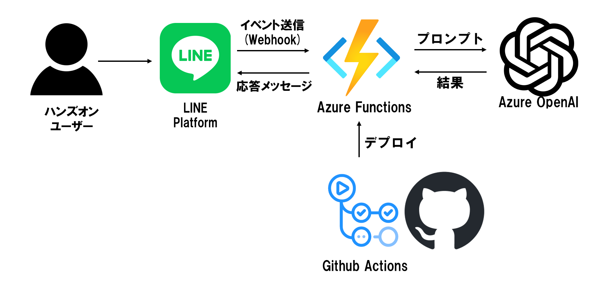

# hol-azure-line-bot
## 概要
本ハンズオンではMicrosoftのクラウドサービス、Azureを活用したWebアプリケーションの開発を通し、  
基本的なクラウドの知識・Azureの使い方を学ぶことができます。  
  
本リポジトリをcloneもしくはダウンロードしてから手順を開始してください。

## 実施環境
本サンプルは下記のツールやアカウントを用意した上で実施することを推奨します。
- Visual Studio Code
    - https://azure.microsoft.com/ja-jp/products/visual-studio-code/
- Visual Studio Code 用の C# 拡張機能
    - https://marketplace.visualstudio.com/items?itemName=ms-dotnettools.csharp
- Visual Studio Code 用の Azure Functions 拡張機能
    - https://marketplace.visualstudio.com/items?itemName=ms-azuretools.vscode-azurefunctions
- Visual Studio Code 用の Azure Tools 拡張機能
    - https://marketplace.visualstudio.com/items?itemName=ms-vscode.vscode-node-azure-pack
- .NET 6.0
    - https://dotnet.microsoft.com/ja-jp/download/dotnet/6.0
- Azure アカウント
    - https://azure.microsoft.com/ja-jp/free/
- LINE Developers アカウント
    - https://developers.line.biz/ja/docs/line-developers-console/login-account/
- Docker Desktop 
    - https://www.docker.com/ 
- git 
    - https://git-scm.com/

## 本ハンズオンで実装するアーキテクチャ

## 目次
1. [ソースコードの準備](./docs/1-prepare-sourcecode.md)
2. [Functionsの作成](./docs/2-functions-create.md)

上記手順完了後、作成した全てのリソースグループを削除してください。
