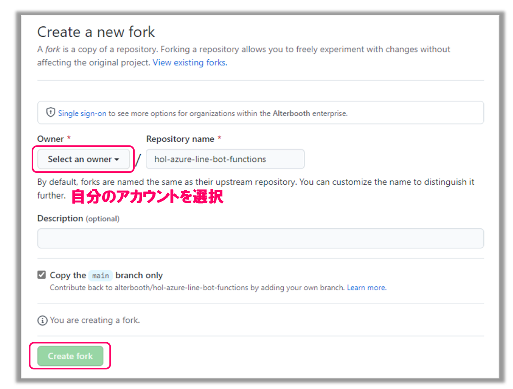

# 1. ソースコードの準備
## 1-1. GitHubからソースコードを取得
はじめに、GitHubからソースコードをフォークします。  
[ハンズオンのソースコードリポジトリ](https://github.com/alterbooth/hol-azure-line-bot-openai) を開き、右上の「Fork」をクリックします。

Ownerの「Select an owner」でご自身のアカウントを選択し、一番下の「Create fork」でフォークを作成します。

フォーク後、ご自身のリポジトリが作成されていることが確認できたら、次のステップ「[2. LINE Botの作成](./2-create-linebot.md)」へ進みます。
