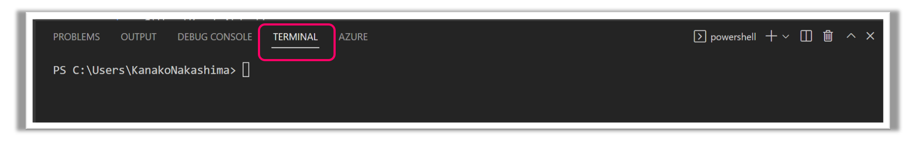
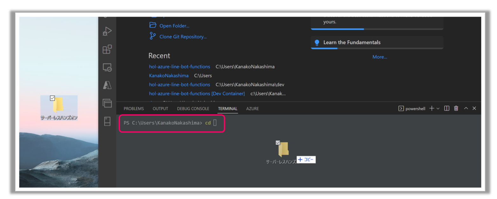
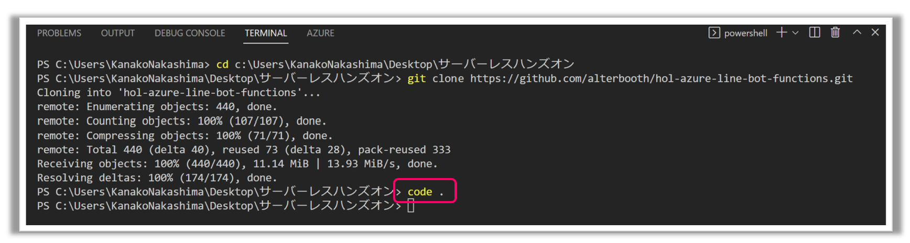

# 1. ソースコードの準備
## 1-1. Githubからソースコードを取得
はじめに、このハンズオンで使用するコードの保存先をつくります。任意の場所に「フォルダ」を作成。
今回はフォルダ名を`handson`とします。

次に、Githubからソースコードをフォークします。
[Githubハンズオンリポジトリ](https://github.com/alterbooth/hol-azure-line-bot-functions) を開き、右上の「Fork」をクリックします。

Ownerの「Select an owner」で自分のアカウントを選択し、一番下の「Create fork」でフォークを作成します。

次に、自分のアカウントのリポジトリからフォークしてきたコードをCloneします。
フォークしたリポジトリの「Code」をクリックし、HTTPSをコピーします。

VSCodeを開き、ターミナルでディレクトリを先ほど作ったフォルダに移動し、クローンしたリポジトリを開きます。 
まずは、VSCodeの左下をクリックし、ターミナルを開きます。

<!-- ターミナルで「cd 保存先のディレクトリ」(cd半角スペース)と入力し、handsonディレクトリに移動 -->
<!--  -->
ターミナルで`handson`ディレクトリに移動し、「git clone https://github.com/alterbooth/hol-azure-line-bot-functions.git 」とコマンドを入力します。

「code .」とコマンド入力すると、ローカルでコードを開きます。

## 1-2. devcontainerを使って開発環境を立ち上げる
まずは、「Docker Desktop」を開いておきます。
先ほど開いたソースコードのVSCodeで、「F1キー」を押し、「Dev Containers:Reopen in Container」を選択。

VSCodeが立上がりコンテナが動いているのが確認できます。

次に、ローカルで関数アプリを立ち上げます。 
今立ち上がったVSCodeのターミナルでhol-azure-line-bot-functionsのFunctionsディレクトリに移動し、「func start --csharp」とコマンド入力します。

