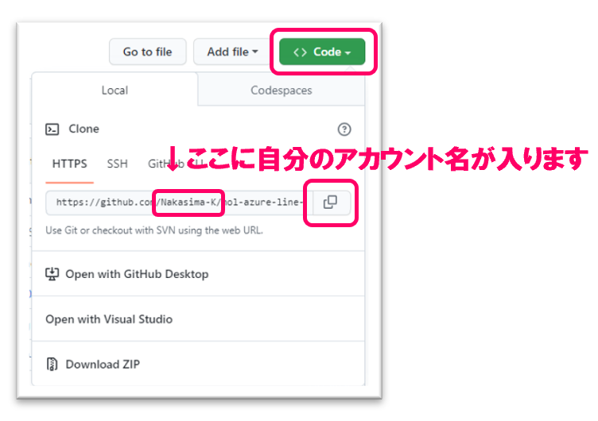
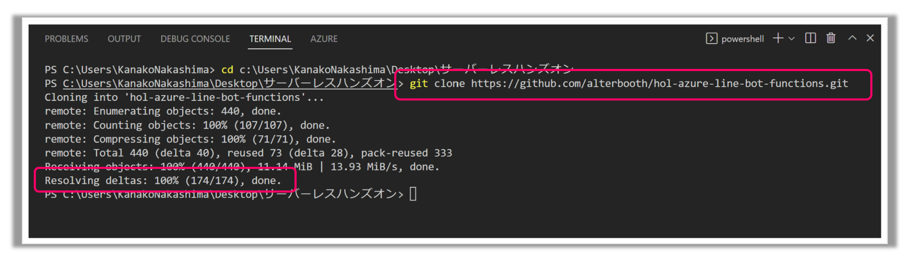
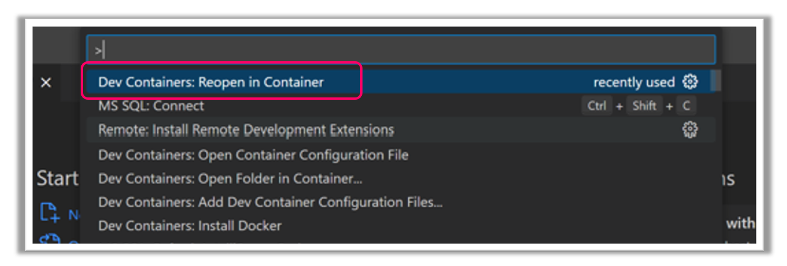
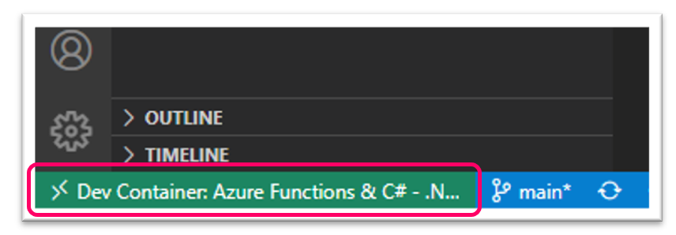
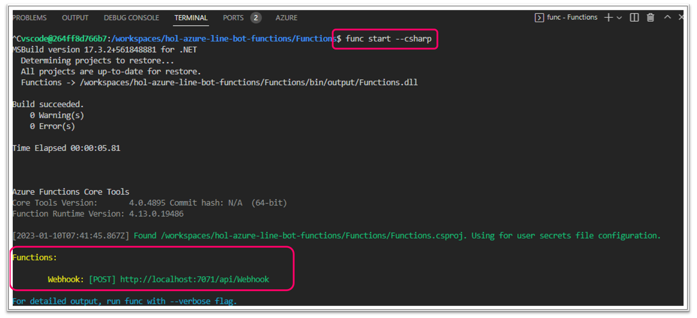

# 1. ソースコードの準備
## 1-1. Githubからソースコードを取得
はじめに、このハンズオンで使用するコードの保存先をつくります。任意の場所に「フォルダ」を作成。  
今回はフォルダ名を`handson`とします。

次に、Githubからソースコードをフォークします。  
[ハンズオンのソースコードリポジトリ](https://github.com/alterbooth/hol-azure-line-bot-functions) を開き、右上の「Fork」をクリックします。

Ownerの「Select an owner」で自分のアカウントを選択し、一番下の「Create fork」でフォークを作成します。

次に、自分のアカウントのリポジトリからフォークしてきたコードをCloneします。  
フォークしたリポジトリの「Code」をクリックし、HTTPSをコピーします。
  

PCのターミナルを開き、`handson`ディレクトリに移動し、`git clone コピーしてきたHTTPS`とコマンドを入力します。  
(PCのターミナルでgitコマンドが使えるようにしておいてください。)

VSCodeを開き、左上の「File」→「Open Folder」で`handson`フォルダを選択、ローカルでコードを開きます。    
     
## 1-2. devcontainerを使って開発環境を立ち上げる
まずは、`Docker`を起動した状態(Docker Desktopを使用する場合は、Docker Desktopを起動した状態)にします。  
先ほど開いたソースコードのVSCodeのターミナルで、今回クローンしてきた`hol-azure-line-bot-functions`ディレクトリに移動します。  
F1キーを押し、「Dev Containers:Reopen in Container」を選択。

VSCodeが立上がりコンテナが動いているのが確認できます。

次に、ローカルで関数アプリを立ち上げます。   
devcontainerが動いているターミナルでhol-azure-line-bot-functionsの`Functions`ディレクトリに移動し、`func start --csharp`とコマンド入力します。下の画像のように、`webhook: [POST] http://localhost:7071.....`がでたらdevcontainer上でFunctionsの起動が成功です！

確認できたら、次のステップ「[Functionsの作成](/docs/2-functions-create.md)」へ進みます。

