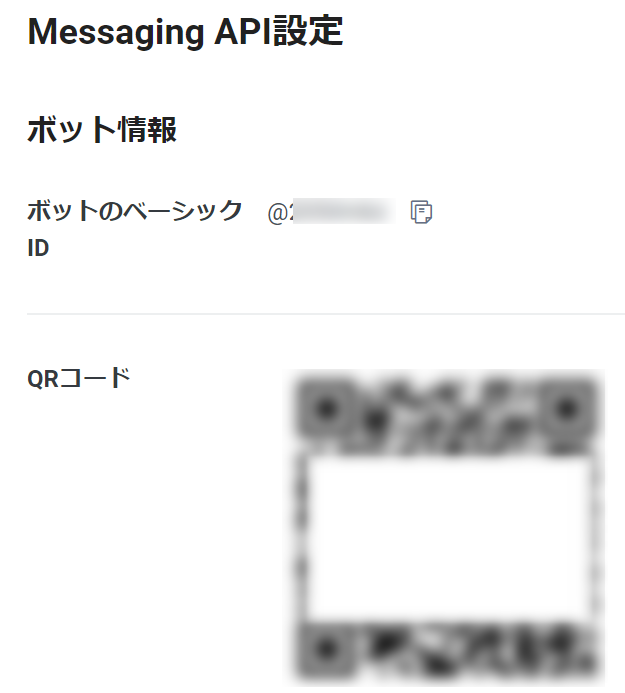

# 2. LINE Botの作成
この章では、今回実装するLINE BotのバックエンドとなるAzure Functionsをデプロイし、オウム返しを行うLINE Botを作成・設定します。

## 2-1. LINEチャネル作成
まずはLINEチャネルを作成するため、 [LINE Developers Console](https://developers.line.biz/console/) を開きます。  

### プロバイダー作成（今回使用するプロバイダーがまだ無い場合のみ）
まだプロバイダーを登録していない場合は、任意の名前で登録します。

### LINE Messaging APIチャネル作成
LINE Messaging APIのチャネルを作成します。  
↓のアイコンを選択します。

必須項目に任意の値を入力し、利用規約の同意にチェックした後「作成」を選択します。

次に、Messaging APIに関する各種設定を行います。  
「Messaging API設定」タブを開きます。

応答メッセージをオフにします。（オンの状態だと、毎回定型文が返答されてしまうため）

次に、LINE Developersのページに戻り

チャネルアクセストークンを発行し、メモ帳などに控えておきます。

## 2-2. Azure Functionsリソース作成
### リソースグループ作成
次に、 [Azureポータル](https://portal.azure.com) を開きます。  
先にリソースグループを作成するため、上部の検索バーから「リソース」と入力し「リソース グループ」を選択します。

「作成」ボタンから、リソースグループ作成画面を開き、情報を入力します。

「確認および作成」タブより、「作成」ボタンを押下します。

### Azure Functions作成
次に、Azure Functionsのリソースを作成します。  
作成したリソースグループを開き、「作成」ボタンを選択します。

リソースの作成画面が開けたら、「関数アプリ」を選択します。

下記に倣って情報を入力します。  
入力後「確認および作成」を選択、確認および作成の画面で「作成」と移ってください。

- リソース グループ：先ほど作成したもの
- 関数アプリ名：ユニークな値（例: `func-自分の名前-linebot-handson-日付` ）
- 公開： `コード`
- ランタイム スタック： `.NET`
- バージョン： `6 (LTS)`
- 地域： `Japan East`
- オペレーティング システム： `Windows`
- ホスティング オプションとプラン： `消費量 (サーバーレス)`

以下のように「デプロイが完了しました」と表示されれば、Azure Functionsリソース作成完了です。

### アプリケーション設定にLINEチャネルアクセストークンを追加
先ほど発行したLINEチャネルアクセストークンを、下記手順でAzure Functionsに設定します。

- Functionsのリソースへ移動
- リソース画面の左サイドメニューにある設定→構成へ移動
- アプリケーション設定に「新しいアプリケーション設定」を追加
  - 名前： `LINE_CHANNEL_ACCESS_TOKEN`
  - 値：先程コピーしたチャネルアクセストークン
- 「保存」ボタンを押下

## 2-3. Azure Functionsのデプロイ
### デプロイセンター設定
Azure Functionsリソースにサンプルコードをデプロイします。  
作成したAzure Functionsを開き、`デプロイセンター`を選択します。

コードソースを選択で「GitHub」を選択し、下記の手順で必要事項を選択したらファイルのプレビューをクリックします。

 - 組織：ご自身のアカウント
 - リポジトリ： `hol-azure-line-bot-functions`
 - ブランチ： `main`

YAMLファイルが右側にでますので「Close」をクリックし、上の「保存」を選択します。

### GitHub Actionsログ確認
GitHubのご自身のリポジトリページに戻り、ページをリロードします。  
`.github/workflows` フォルダが追加されていることが確認できたら、その配下に自動生成されたYAMLファイルが含まれることを確認します。

「Actions」タブを選択し、ビルドとデプロイが正常に実行されているか確認します。  
最終的に緑のチェックマークが表示されればデプロイ成功です。

### Webhook URL設定
LINE Botに設定するWebhook URLを確認します。

まず、Azureポータル上のAzure Functionsの画面に戻り、概要ページ下部の関数一覧から `Webhook`を選択して関数詳細画面を開きます。  
「関数の URL の取得」ボタンから、URLを取得します。

次に、Messaging API設定画面のWebhook URLに入力し、保存します。  
保存後、「Webhookの利用」をオンにします。

## 2-4. 動作確認
Messaging API設定画面中で確認できるQRコードをご自身の端末から読み込み、LINE友達登録します。

ご自身の端末からLINEを開き、送信したメッセージと同じメッセージが返信されることを確認します。

返信メッセージが確認できたら、次のステップ「[3. 返信内容の変更と再デプロイ](/docs/3-reply-redeploy.md)」へ進みます。
