# 2. Functionsの作成
## 2-1. Functionsリソース作成
はじめに、リソースグループを作成します。  
[Azureポータル](https://portal.azure.com) を開き、上部の検索バーから「リソース」と入力し「リソース グループ」を選択します。  
  
  
「作成」ボタンから、リソースグループ作成画面を開き、情報を入力します。  
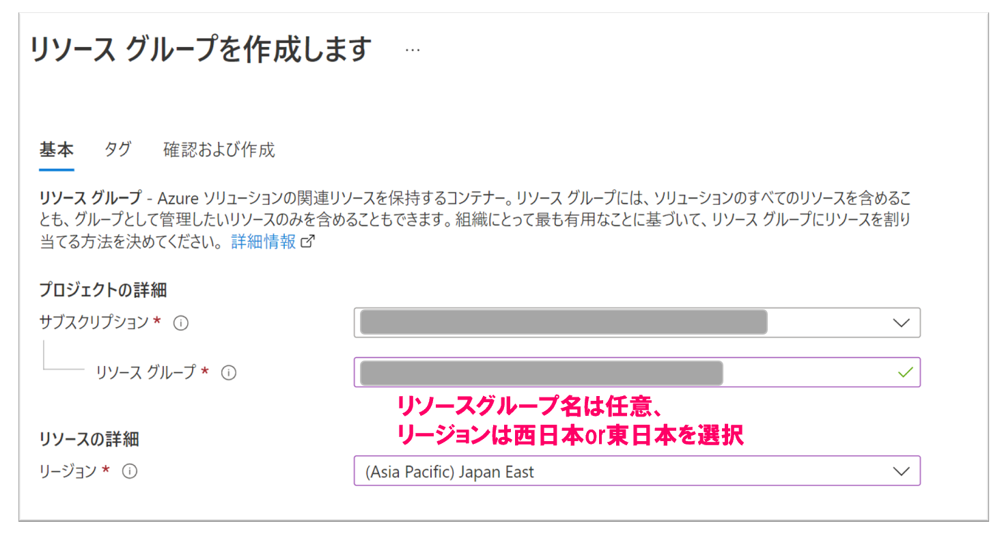  
  
「確認および作成」タブより、「作成」ボタンを押下します。  
  
  
次に、Azure Functionsのリソースを作成します。  
作成したリソースグループを開き、「作成」ボタンを選択します。  
  
  
リソースの作成画面が開けたら、「関数アプリ」を選択します。  
  

プランは`Functions App`で「作成」  
下記スクリーンショットに倣って情報を入力します。  
入力後「確認および作成」を選択、確認および作成の画面で「作成」と移ってください。  
  
  
以下のように「デプロイが完了しました」と表示されれば、Azure Functionsリソース作成完了です。  
  

## 2-2. デプロイ
「Functionsリソース作成」手順で作成したAzure Functionsリソースにサンプルコードをデプロイします。  
作成したAzure Functionsを開き、`デプロイセンター`を選択します。  
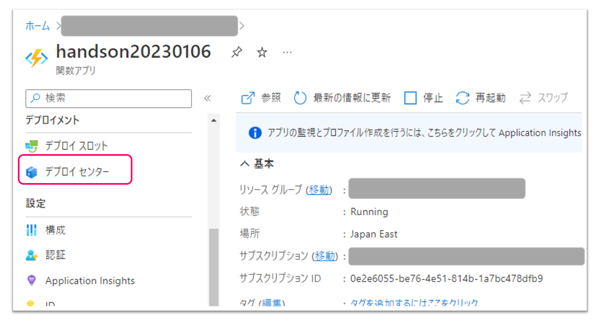  
  
コードソースを選択で「GitHub」を選択し、下記の手順で必要事項を選択したらファイルのプレビューをクリックします。
 - 「組織」自分のアカウント
 - 「リポジトリ」hol-azure-line-bot-functions
 - 「ブランチ」main

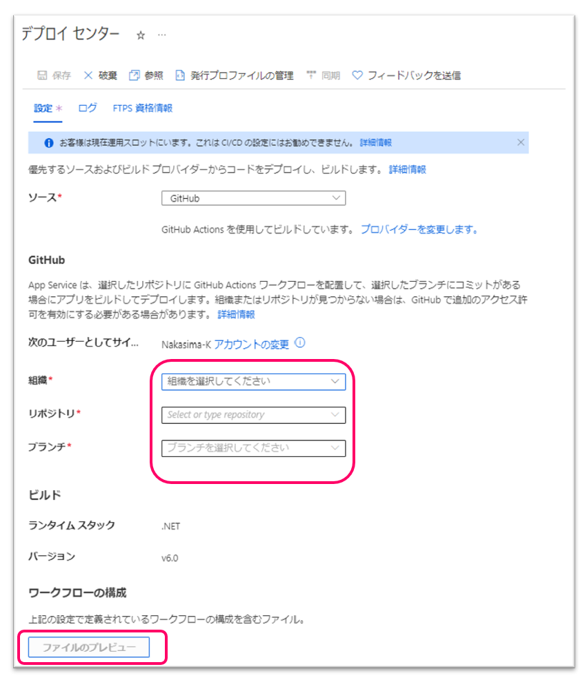  
  
yamlファイルが右側にでますので「Close」をクリックし、上の「保存」を選択します。
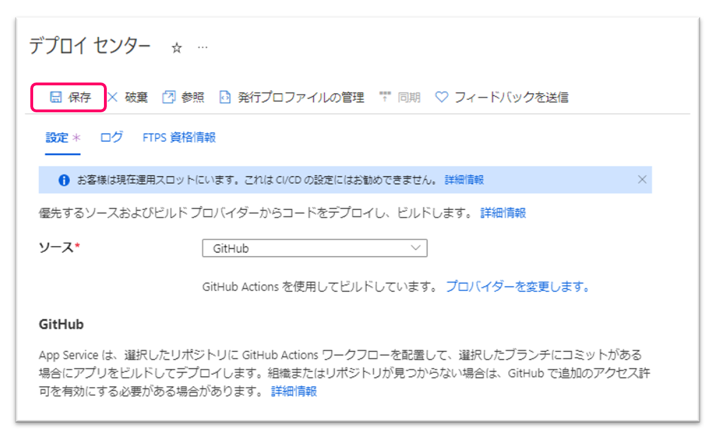  

GitHubの自分のアカウントの`hol-azure-line-bot-functions`に戻り、ページを更新します。`.github/workflows`フォルダができていることが確認できます。この中に自動生成されたyamlファイルが含まれます。
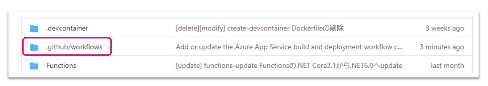

「Actions」を選択し、ビルドとデプロイができているか確認し、緑のチェックマークになっていればビルドとデプロイ成功です。
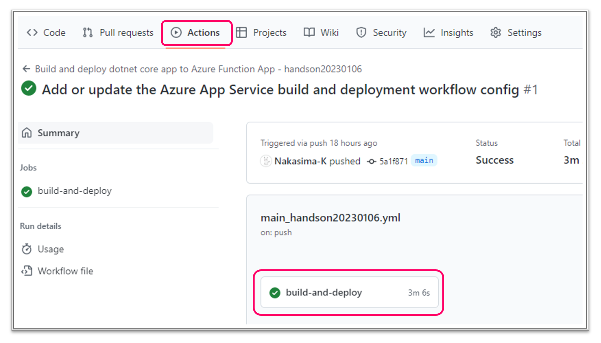

リモートリポジトリにできたyamlファイルをローカルにもコピーします。  
VSCodeのターミナルで`hol-azure-line-bot-functions`ディレクトリに移動し、`git fetch`コマンドを入力した後に`git pull`コマンドを入力します。
ローカルに`.github/workflows`フォルダの中に**yamlファイル**ができていることが確認できます。
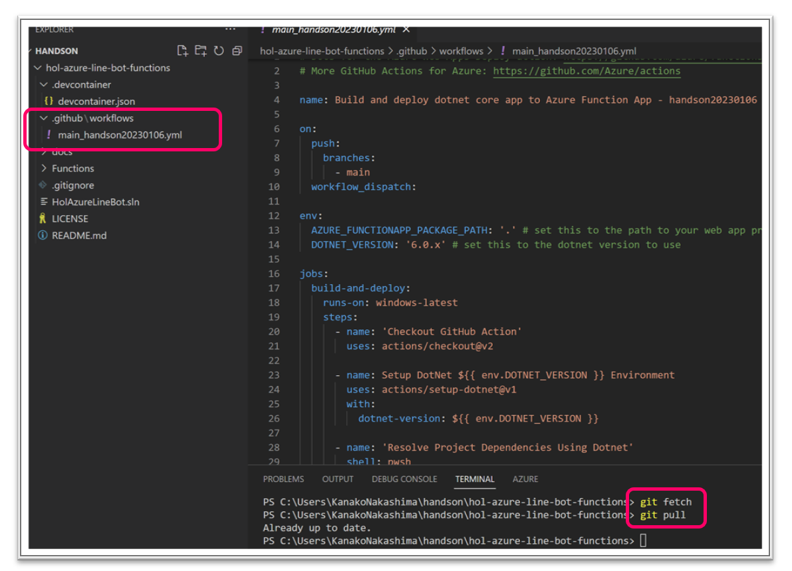

## 2-3. LINEチャネル作成
[LINE Developers Console](https://developers.line.biz/console/) を開きます。  
プロバイダーを登録していない場合は、任意の名前で登録します。  
  
  
LINE Messaging APIのチャネルを作成します。  
↓のアイコンを選択します。  
  
  
必須項目に任意の値を入力し、利用規約の同意にチェックした後「作成」を選択します。  
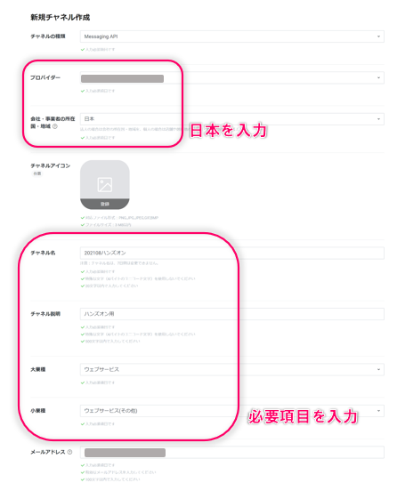  
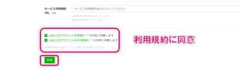  
  
次に、Messaging APIに関する各種設定を行います。  
「Messaging API設定」タブを開きます。  
  
  
応答メッセージをオフにします。（オンの状態だと、毎回定型文が返答されてしまうため）  
  
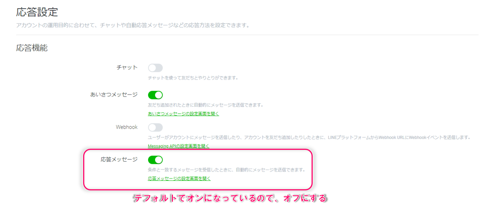  

次に、LINE Developersのページに戻り   
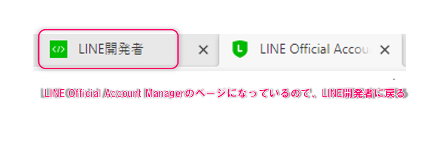    

チャネルアクセストークンを発行し、コピーします。  
  
  
発行したチャネルアクセストークンを下記手順でAzure Functionsに設定します。
- 先に作成しておいたFunctionsのリソースへ移動
- リソース画面の左サイドメニューにある設定→構成へ移動
- アプリケーション設定に「新しいアプリケーション設定」を追加
  - 名前： `LINE_CHANNEL_ACCESS_TOKEN`
  - 値：先程コピーしたチャネルアクセストークン
- 「保存」ボタンを押下
  
  
  
Webhookの設定を更新します。  
AzureポータルよりFunctionsのURLを取得します。  
  
  
  
  
Messaging API設定画面のWebhook URLに入力し、更新後、「Webhookの利用」をオンにします。  
  
  
Messaging API設定画面中で確認できる**QRコード**を読み込み、LINE友達登録します。

## 2-4. 動作確認
LINEを開き、送信したメッセージと同じメッセージが返信されることを確認します。  
    
  

