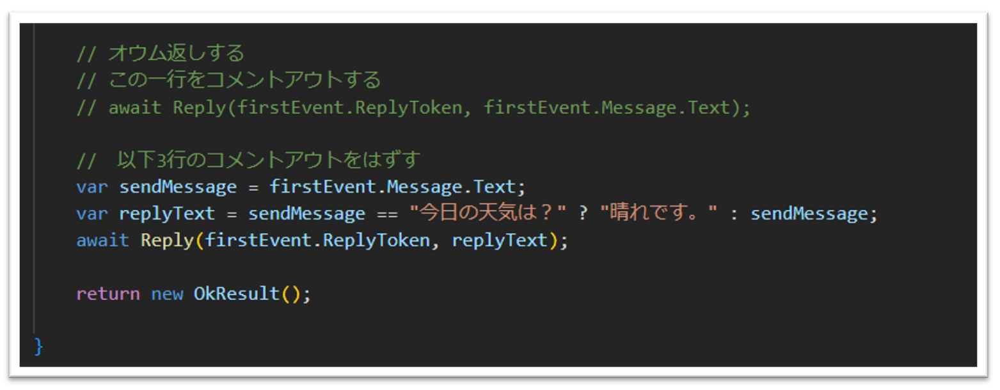
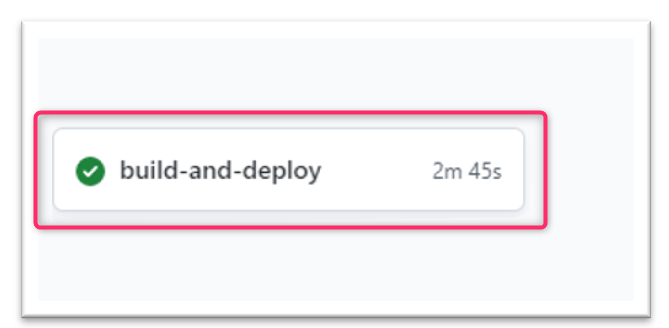
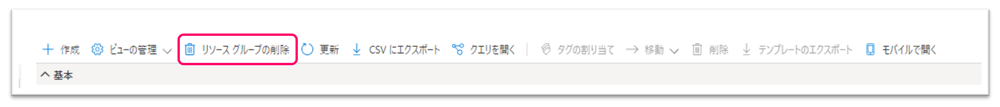

# 3. 返答内容の変更と再デプロイ
## 3-1. LINEの返答内容を変更
LINEで送信したメッセージと違うメッセージが返信するように変更します。  
まずVSCodeで`Functions/Webhook.cs`ファイルを開きます。  
コードの中に**オウム返しをする**というコメントがあります。近くに`コメントアウトする`と`コメントアウトをはずす`という記載がありますので、内容に従って作業し、コードを保存します。  
  

## 3-2. 再デプロイ
ターミナルで下記のコマンドを実行し、GitHubにpushします。  
```
git add .  
git commit -m "Update reply message"
git push origin main 
```

次にGitHub Actionsの実行結果を確認します。  
ご自身のGitHubリポジトリページから「Actions」タブを開きます。  
ビルドとデプロイができているか確認し、緑のチェックマークになっていれば再ビルドと再デプロイが成功です。  


## 3-3. LINEで返答確認  
LINEで返信が変わっているか確認します。  
先ほどは送信メッセージと同じメッセージが返ってきていました。  
LINEで`今日の天気は？`と入力し、送信します。 **晴れです。** と返信がきたら成功です。  


ハンズオンの内容は以上になります。  
お疲れ様でした:blush:

## ハンズオン終了後
**今回のハンズオンが終了したら、Azureポータルからハンズオン用に作成した全てのリソースグループを削除してください。**  
（※弊社よりハンズオン用環境を払い出ししている場合は一旦削除せず、スタッフにご確認ください。）
  

時間が余った方は、ローカルデバッグにチャレンジしてみましょう！「[（上級編）Dev Containersとngrokを使ってローカルデバッグを行う](/docs/4-document-suppliment.md)」
