# 3. Azure OpenAI Serviceを使って返信内容を作成するよう更新
## 3-1. Azure OpenAI Serviceの作成
### Azure OpenAI Serviceリソースの作成
まず、Azure OpenAI Serviceのリソースを作成します。  
[Azureポータル](https://portal.azure.com) から、前章で作成したリソースグループを開き、「作成」ボタンを選択します。

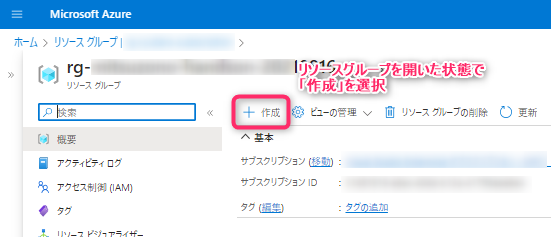

検索バーに「openai」等を入力し、Azure OpenAIを検索し、「作成」のプルダウンメニューから「Azure OpenAI」を選択しリソースを作成します。

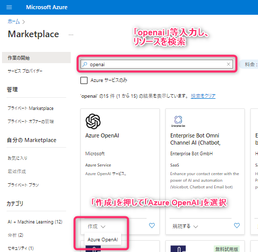

下記スクリーンショットに倣って情報を入力します。  
入力後確認および作成の画面で「作成」へと移ってください。

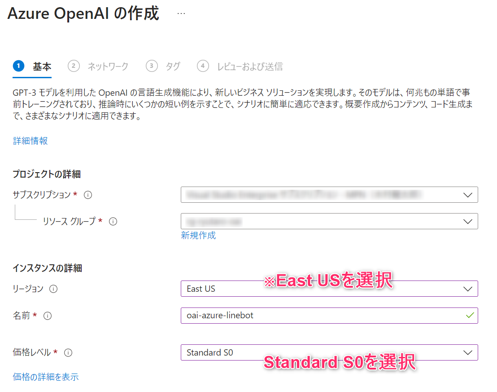

以下のように「デプロイが完了しました」と表示されれば、Azure OpenAI Serviceリソースの作成が完了です。

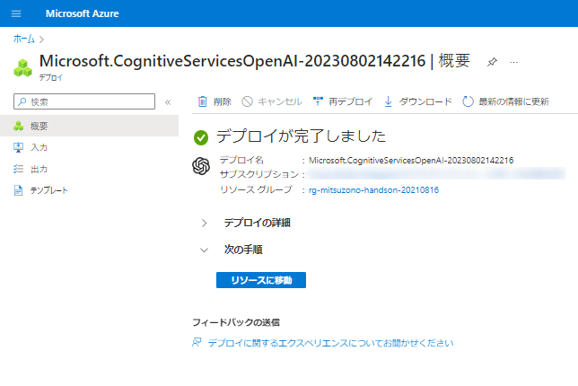

### モデルのデプロイ
作成したAzure OpenAI Serviceリソースを開き、「探索」を選択します。

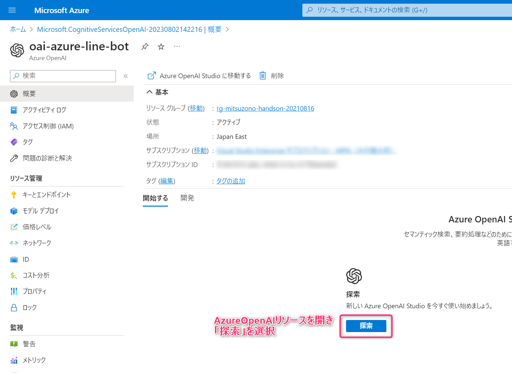

「デプロイ」タブへと移動し、「新しいデプロイの作成」を選択します。

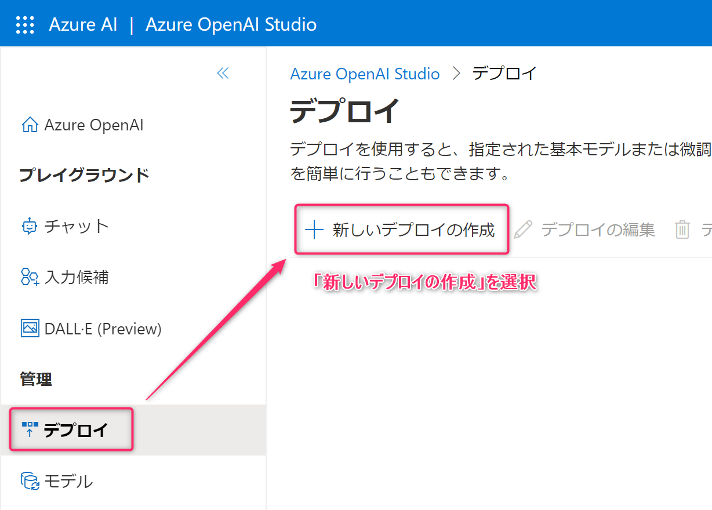

下記スクリーンショットに倣って情報を入力します。  
入力後、「作成」を選択します。

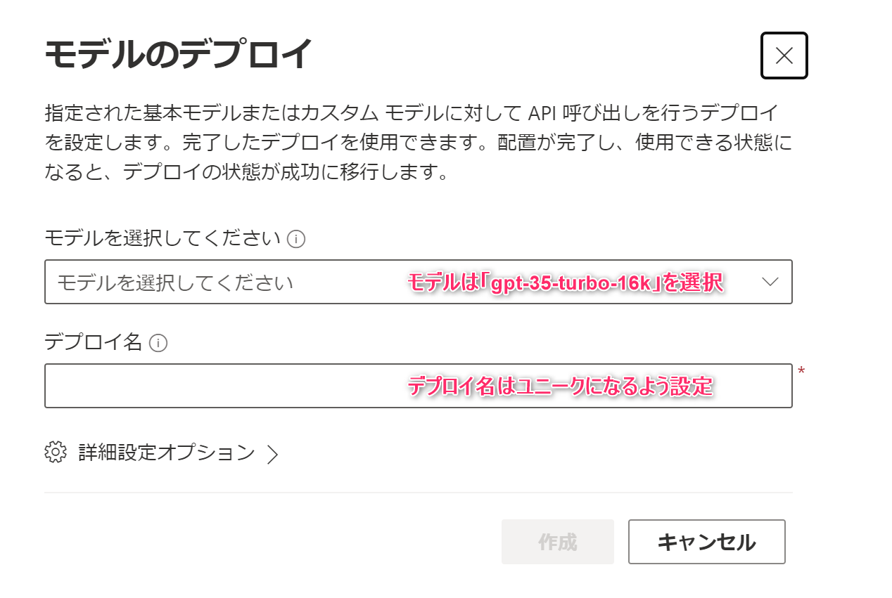

以下のように作成したモデルが表示されれば、モデルのデプロイ作成完了です。

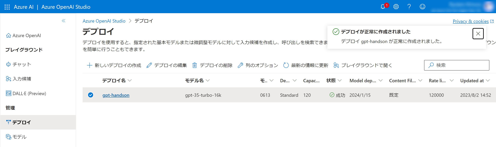

### エンドポイントとキーの確認
右上の歯車アイコンを選択した後、「Resource」タブを開きます。

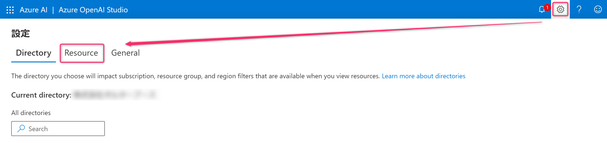

作成したOpenAIリソースのエンドポイントとキーはこのページで確認できます。  
「Endpoint」、「Key」の値を控えておきます。

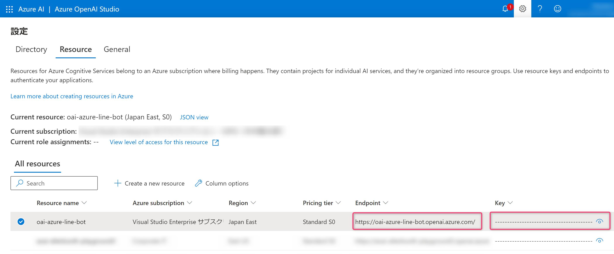

## 3-2. Azure Functionsの更新
### アプリケーション設定の追加
使用するAzure OpenAI Serviceリソースの接続情報を、（LINEチャネルアクセストークン同様）下記手順でAzure Functionsのアプリケーション設定に追加します。

- 作成したFunctionsのリソースへ移動
- リソース画面の左サイドメニューにある設定カテゴリ→「構成」タブへ移動
- アプリケーション設定に「新しいアプリケーション設定」を追加
  - `AZURE_OPENAI_API_KEY` : OpenAI Service のキー,
  - `AZURE_OPENAI_API_URL` : OpenAI Service のエンドポイント,
  - `AZURE_OPENAI_API_MODEL_NAME` : OpenAI Service のデプロイ名,
- 「保存」ボタンを押下

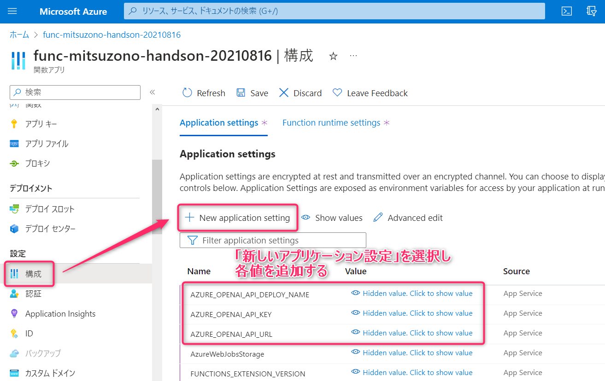

### LINEの返答内容を変更
LINEトークルームへ送信されたメッセージに対して、Azure OpenAI Serviceを介して返答内容を作成するように変更します。  
ソースコードを変更するため、GitHub上の自身のリポジトリのページから `/Functions/Webhook.cs` を開き、鉛筆アイコンのボタン（Edit this file）を押下します。

まず、 `using Azure;` と `Azure.AI.OpenAI;` をアンコメントします。  
（サンプルコードでは[Azure.AI.OpenAIのNuGetパッケージ](https://www.nuget.org/packages/Azure.AI.OpenAI)を使用します。今回は予めサンプルのFunctions.csproj内にパッケージ参照定義を行ってあります。）

```cs
using System.Collections.Generic;
using System.Net.Http;
using System.Text;
using Microsoft.Extensions.Configuration;
using Azure;
using Azure.AI.OpenAI;
```

コードの中に**オウム返しをする**というコメントがあります。  
近くに`コメントアウトする`と`コメントアウトをはずす`という記載があるので、内容に従ってコードを以下のように変更します。

```cs
// オウム返しする
// この一行をコメントアウトする
// await Reply(firstEvent.ReplyToken, firstEvent.Message.Text);

// 以下のコメントアウトをはずす
var prompt = firstEvent.Message.Text;
var client = new OpenAIClient(
    new Uri(Environment.GetEnvironmentVariable("AZURE_OPENAI_API_URL")),
    new AzureKeyCredential(Environment.GetEnvironmentVariable("AZURE_OPENAI_API_KEY")));
var responseWithoutStream = await client.GetChatCompletionsAsync(
    Environment.GetEnvironmentVariable("AZURE_OPENAI_API_MODEL_NAME"),
    new ChatCompletionsOptions()
    {
        Messages =
        {
            new ChatMessage(ChatRole.System, "あなたは親切なアシスタントAIです。"),
            new ChatMessage(ChatRole.User, prompt),
        },
        MaxTokens = 800,
    });
if (responseWithoutStream.Value == null || !responseWithoutStream.Value.Choices.Any())
{
    log.LogWarning("Azure OpenAI Service response is null. prompt = {prompt}", prompt);
    return null;
}
var replyText = responseWithoutStream.Value.Choices[0].Message.Content;
log.LogInformation("replyText: {replyText}", replyText);
await Reply(firstEvent.ReplyToken, replyText);
```

画面右上の「Commit saves...」ボタンを押下して変更を保存します。

### 再デプロイ
先ほどのコミットを起点にGitHub Actionsが実行されるため、その実行結果を確認します。  
ご自身のGitHubリポジトリページから「Actions」タブを開きます。  
ビルドとデプロイができているか確認し、緑のチェックマークになっていれば再ビルドと再デプロイが成功です。


## 3-3. LINE上から動作確認
ご自身の端末からLINEを開き、返信内容が変わることを動作確認します。  
先ほどのような送ったメッセージそのままではなく、Azure OpenAI Serviceが生成した文章が返信されたら成功です。


ハンズオンの内容は以上になります。  
お疲れ様でした:blush:

## 3-4. ハンズオン終了後
**今回のハンズオンが終了したら、Azureポータルからハンズオン用に作成した全てのリソースグループを削除してください。**  
（※弊社よりハンズオン用環境を払い出ししている場合は一旦削除せず、スタッフにご確認ください。）


時間が余った方は、ローカルデバッグにチャレンジしてみましょう！「[4. （上級編）Azure Functionsのローカルデバッグを行う](./docs/4-debug.md)」
