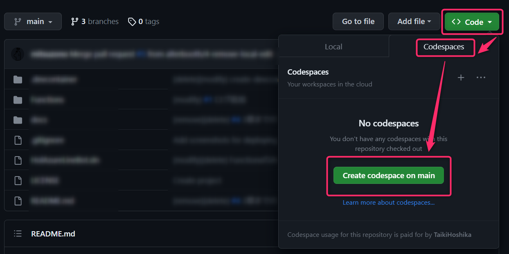
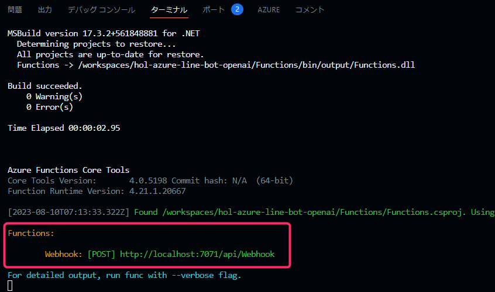
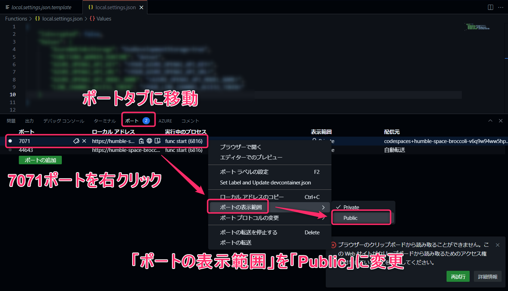
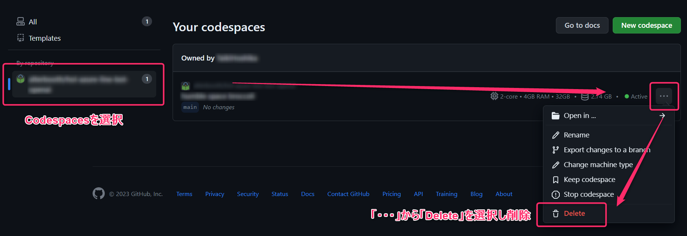

# 4. （上級編）Azure Functionsのローカルデバッグを行う
本章では、Azure Functionsのローカルデバッグを行います。  
Codespacesが利用できる方は [4-1. Codespacesでデバッグを行う](#4-1-codespacesでデバッグを行う) を参考に、利用できない方は [4-2. ローカルPCでのデバッグ手順](#4-2-ローカルpcでのデバッグ手順) を参考に進めてください。

## 4-1. Codespacesでデバッグを行う
### Codespacesを起動
ご自身のGitHubリポジトリページから「Code」ボタンを選択し、出てきたメニューの「Codespaces」タブを選択します。  
「Create codespace on main」を選択します。



### local.settings.jsonを作成
`Functions/local.settings.json` ファイルを作成します。  
`Functions/local.settings.json.template` の中身をコピーし、 `LINE_CHANNEL_ACCESS_TOKEN` 、 `AZURE_OPENAI_API_～` にそれぞれ、以前の手順でAzure Functionsに設定したものと同じ値を設定します。

- `LINE_CHANNEL_ACCESS_TOKEN` の設定内容は [こちら](./2-create-linebot.md#アプリケーション設定にlineチャネルアクセストークンを追加)
- `AZURE_OPENAI_API_～` の設定内容は [こちら](./3-update-reply-from-openai.md#アプリケーション設定の追加)

### Functionsをデバッグ起動
Codespaces画面下部の「ターミナル」タブから、追加で新しくターミナルを開きます。  
以下コマンドで `Functions` ディレクトリに移動し、Azure Functionsをデバッグ起動します。

```
cd Functions
func start --csharp
```

下の画像のように、 `Webhook: [POST] http://localhost:7071/api/Webhook` と表示されたらCodespaces上でのAzure Functionsのデバッグ起動が成功です。



### ポートの公開範囲を変更
Codespaces画面下部の「ポート」タブを開きます。  
ポート `7071` を右クリックし、「ポートの表示範囲」を「Public」に変更します。  
この時生成されている公開用のURLを控えておいてください。



### LINE Webhook URLの設定と動作確認
先ほど控えておいた公開用URLに `/api/Webhook` と付ける形でLINE DevelopersのWebhook URL設定に設定します。

その後、ご自身の端末からLINEを開き、メッセージのやり取りができるかを確認します。  
この時、ソースコードを変更して再度デバッグ起動したり、Codespaces上のターミナルにAzure Functionsの実行ログが流れるかなどを確認してみましょう。

### Codespacesの削除
**ここまでの手順が完了したら、使用したCodespacesを忘れずに削除しましょう。**  
[Codespaces管理画面](https://github.com/codespaces) を開き、自身のCodespaces一覧を表示します。  
画面左側の「By Repository」から使用したCodespacesの詳細を開きます。
右側の「…」を選択し、「Delete」で削除します。



## 4-2. ローカルPCでのデバッグ手順
本章ではローカルPCでソースコードの実行を行うため、事前にソースコードをcloneしてください。  
また、本章の実施には [任意の事前準備環境](./../README.md#任意上級編のローカルデバッグを行いたい方向け) が必要になります。

### Dev Containersを使って開発環境を立ち上げる
まずは、`Docker`を起動した状態(Docker Desktopを使用する場合は、Docker Desktopを起動した状態)にします。  
VSCodeを起動し、左上の「File」→「Open Folder」で`hol-azure-line-bot-functions`フォルダを開きます。  
VSCode上でF1キーからコマンドパレットを起動し、「Dev Containers:Reopen in Container」を選択します。


VSCodeが起動しなおし、コンテナが動いていることが確認できます。


### local.settings.jsonを作成
`Functions/local.settings.json` ファイルを作成します。  
内容は `Functions/local.settings.json.template` の中身をコピーし、 `LINE_CHANNEL_ACCESS_TOKEN` 、 `AZURE_OPENAI_API_～` にそれぞれ、以前の手順でAzure Functionsに設定したものと同じ値を設定します。

- `LINE_CHANNEL_ACCESS_TOKEN` の設定内容は [こちら](./2-create-linebot.md#アプリケーション設定にlineチャネルアクセストークンを追加)
- `AZURE_OPENAI_API_～` の設定内容は [こちら](./3-update-reply-from-openai.md#3-4-環境変数の設定)

### Functionsをデバッグ起動
VSCode上で、追加で新しくターミナルを開きます。  
以下コマンドで `Functions` ディレクトリに移動し、Azure Functionsをデバッグ起動します。

```
cd Functions
func start --csharp
```

下の画像のように、 `Webhook: [POST] http://localhost:7071/api/Webhook` と表示されたらDev Containers上でのAzure Functionsのデバッグ起動が成功です。


### ngrokを使用したLINE Botとの疎通
ngrokが使用できるターミナルを開き、以下コマンドを実行します。

```
ngrok http 7071
```

このコマンドにより、発行されたngrokのURL（例: `https://1234-567-890.jp.ngrok.io` ）が http://localhost:7071 にトンネリングされます。  
LINE DevelopersコンソールのWebhook URLの設定に、この発行されたngrokのURLに `/api/Webhook` とつけたもの（例: `https://1234-567-890.jp.ngrok.io/api/Webhook` ）を設定します。


LINEアプリのトークルームでBotにメッセージを送ると、ローカルデバッグしているAzure Functionsが動作します。  
以上で、Dev Containersを使用したAzure Functionsのローカルデバッグならびに、ngrokを使用したLINE Botからローカルで実行中のAzure Functionsへの疎通手順が完了しました。  
試しに、ローカルのソースコードを変更し、動作確認してみてください。

## 4-3. 参考資料
### Azure Functions
Azure Functions の概要 | Microsoft Learn  
https://learn.microsoft.com/ja-jp/azure/azure-functions/functions-overview

Azure Functions のトリガーとバインド | Microsoft Learn  
https://learn.microsoft.com/ja-jp/azure/azure-functions/functions-bindings-http-webhook

### Azure OpenAI Service
Azure OpenAI Service とは - Azure AI services | Microsoft Learn  
https://learn.microsoft.com/ja-jp/azure/ai-services/openai/overview

クイック スタート - モデルのデプロイと Azure OpenAI Service を使用したテキストの生成を行う - Azure OpenAI | Microsoft Learn  
https://learn.microsoft.com/ja-jp/azure/ai-services/openai/quickstart?tabs=command-line&pivots=programming-language-csharp

### LINE Messaging API
Messaging APIリファレンス | LINE Developers （メッセージイベント）  
https://developers.line.biz/ja/reference/messaging-api/#wh-text

Messaging APIリファレンス | LINE Developers （応答メッセージを送る）  
https://developers.line.biz/ja/reference/messaging-api/#send-reply-message
